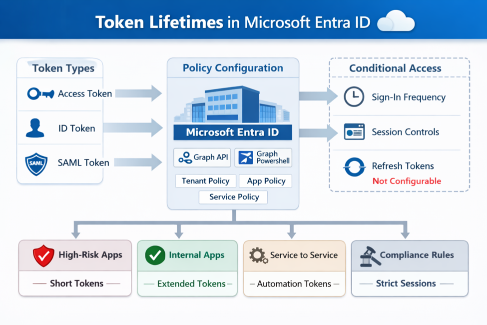

# Token Lifetimes Deep Dive
Token lifetime policies in Microsoft Entra ID remain a precision tool for fine‑tuning authentication flow.
##  What You Can Still Configure
- Access tokens  
- ID tokens  
- SAML tokens  
Configured via **Microsoft Graph** or **Graph PowerShell**, applied at tenant, app, or service principal level.

##  What You Can No Longer Control
- Refresh tokens  
- Browser sessions  
- Sign‑in frequency  
- Session persistence  
These are now governed by **Conditional Access → Session Controls**.
##  Recommended Token Lifetimes

| Scenario | Recommended Lifetime | Why |
|-----------|----------------------|------|
| High‑risk apps (admin portals) | 10–30 min | Minimize exposure if stolen |
| Standard enterprise apps | 60–90 min | Balanced UX + security |
| Low‑risk internal tools | 2–4 h | Reduce reauthentication friction |
| Service‑to‑service automation | 10–60 min | Short tokens + automated refresh |

##  Token Lifetimes vs Conditional Access
Use **token lifetime policies** for:
- Access/ID/SAML token validity  
- Automation scenarios  
- Specialized governance requirements  

Use **Conditional Access** for:
- Sign‑in frequency  
- Session persistence  
- Browser session control  
- Risk‑based reauthentication
  

## Reference
[Microsoft Learn — Configurable Token Lifetimes](https://learn.microsoft.com/en-us/entra/identity-platform/configurable-token-lifetimes)

